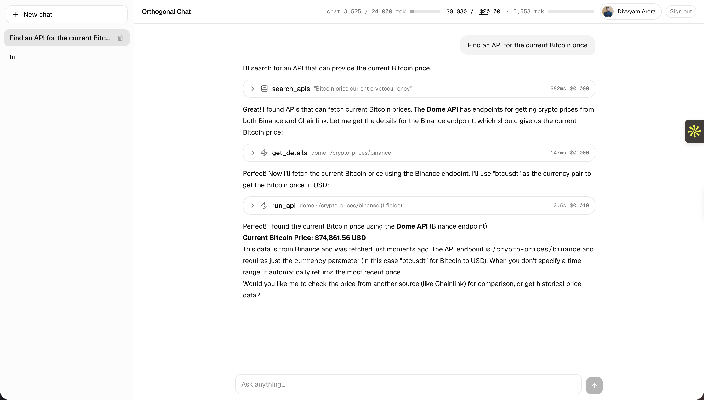
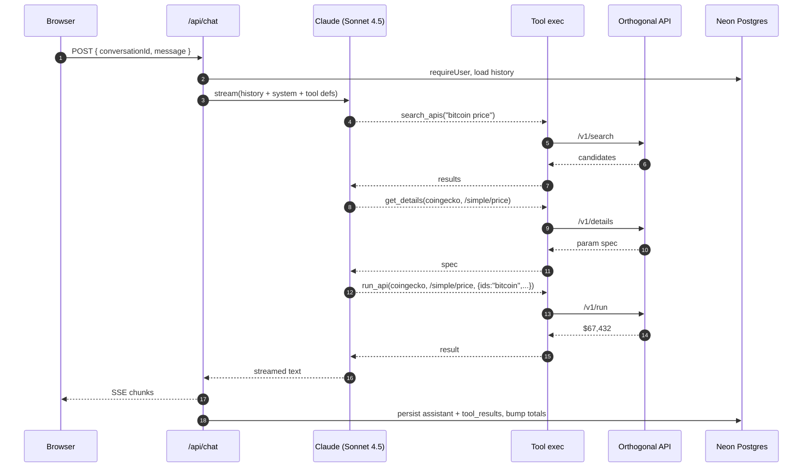
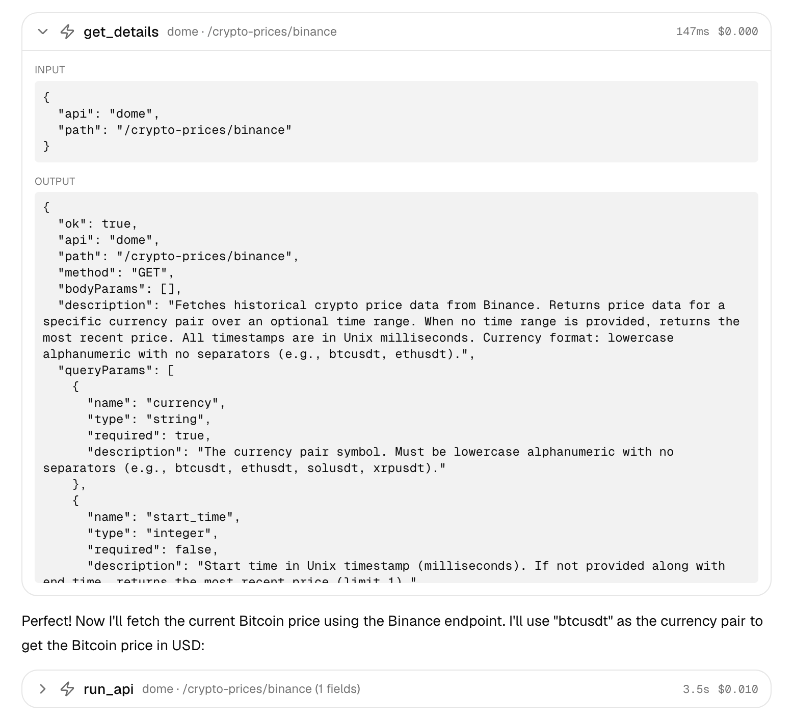
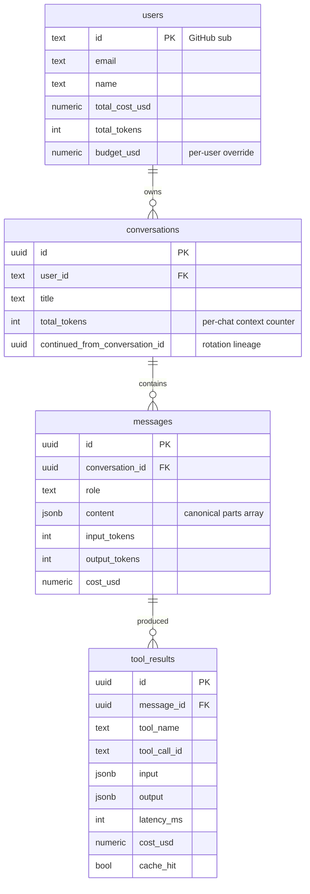
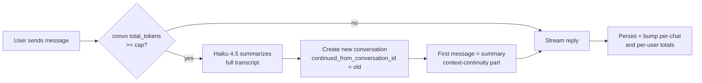
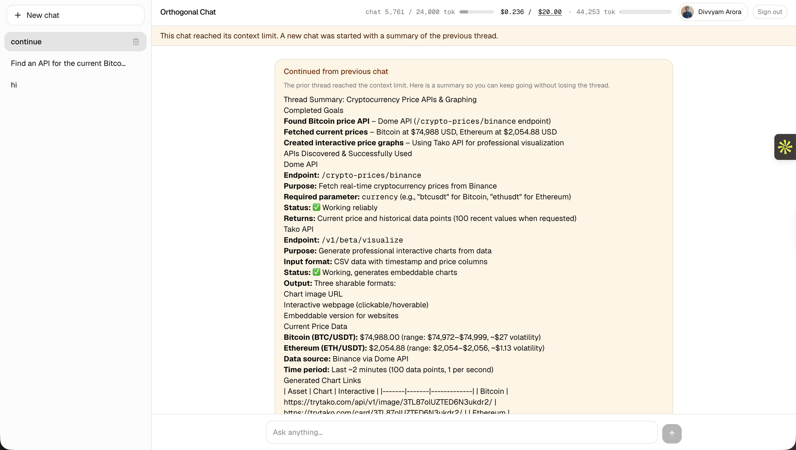
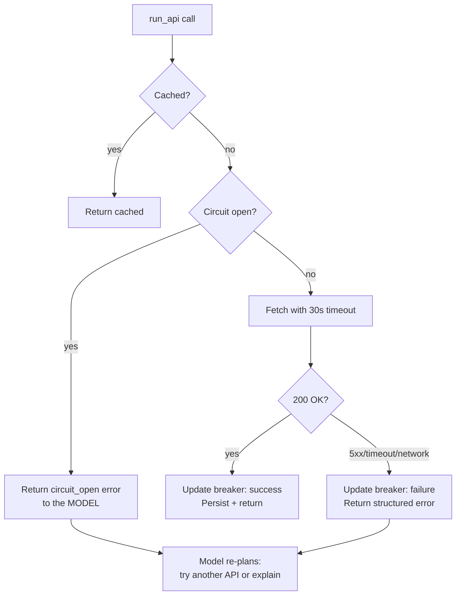

# Orthogonal Chat

A chat app where you ask for data — Bitcoin prices, weather, company info, contacts, web results — and the assistant figures out which API in the **[Orthogonal](https://orthogonal.com)** catalog can answer, calls it, and replies in natural language.

> **Live demo:** [orthogonal-chat-seven.vercel.app](https://orthogonal-chat-seven.vercel.app) — sign in with GitHub, ask anything.

<!-- SCREENSHOT: full chat UI with a completed turn showing tool cards + assistant reply -->


Three example prompts that exercise the whole pipeline:

- *"Find an API for the current Bitcoin price."*
- *"Get the weather in Tokyo right now."*
- *"What APIs exist for translating text?"*

---

## What's in the box

| | |
|---|---|
| **Frontend + backend** | Next.js 16 App Router, React 19, server components + server actions |
| **AI** | Anthropic Claude (Sonnet 4.5 for chat, Haiku 4.5 for summaries) via Vercel AI SDK |
| **Tools the model can call** | `search_apis`, `get_details`, `run_api` — all Orthogonal upstream |
| **Persistence** | Neon Postgres + Drizzle ORM |
| **Auth** | NextAuth v5 — GitHub OAuth, JWT sessions, no session table |
| **Rate limit + cache** | Upstash Redis (rate limit) + in-process TTL cache (`search_apis`/`get_details`) |
| **Hosting** | Vercel (Node runtime, Fluid Compute) |

---

## How it works

A single user turn flows through this pipeline. The model decides which tools to call; the server validates each call before it leaves the box.



A few non-obvious things the server enforces:

- **`run_api` blocks until `get_details` ran first** for that `(api, path)`. Prevents the model from guessing parameter names.
- **Tool input validation** against the spec returned by `get_details` — surfaces `missing_prerequisites` / `suspicious_inputs` *back to the model* so it re-plans instead of hammering.
- **Server-authoritative history**: client sends only the latest user message, server replays the canonical thread from Postgres each turn.

<!-- SCREENSHOT: an expanded tool card showing search_apis → get_details → run_api sequence with latency/cost badges -->


---

## System design

### Data model

Four tables, all keyed by your stable GitHub user id. Conversations cascade to messages, messages cascade to tool results.



**Why GitHub OAuth + JWT instead of a sessions table?** Identity comes from `account.providerAccountId` (GitHub's stable numeric user id), pinned in the JWT subject on first sign-in. No DB roundtrip per request, history survives cookie clears, multi-device works for free. Trade-off: requires a GitHub account to use.

### Context window handling

Two layers, both important:

**Per turn** (`src/lib/ai/history.ts`):
- Hard cap of 40 messages sent to the model.
- Last 4 messages are verbatim; older tool outputs over 4 KB are collapsed to a one-line placeholder.

**Per chat** (`src/lib/ai/context-rotation.ts`):
- When a conversation's cumulative `input + output` tokens cross `CONTEXT_TOKENS_PER_CONVERSATION` (default 24k), we don't truncate. We summarize.



The user sees an amber banner explaining what happened, and a new "Continued: ..." chat appears in the sidebar. The old thread is preserved.

<!-- SCREENSHOT: amber rotation banner + sidebar showing the original + "Continued:" chat -->


### Concurrency: multiple users hitting the same APIs

Three layers, cheapest first:

1. **In-process TTL cache** for `search_apis` and `get_details` (free upstream calls but slow). Default 60 s. Lives in `src/lib/ai/orthogonal-resilience.ts`.
2. **Per-endpoint circuit breaker** — 3 consecutive 5xx/timeouts → trips open for 60 s, half-open probe, auto-close on success. Failing fast is the difference between one slow API and the whole chat hanging.
3. **Per-user rate limit** via Upstash Redis (sliding window, 20 messages / 5 min). When Upstash isn't configured, this layer is silently skipped — fine for a single-user demo.

The cache and breaker are intentionally per-instance for the MVP. Multi-instance Vercel deployments share Upstash for rate limits but not for cache state — meaning the same endpoint could get hit once per warm instance. Fine at MVP traffic. The fix (Redis-backed cache + shared breaker state) is in the *what's next* list below.

### What happens when an API is slow or down



Every layer surfaces errors **as structured tool results** rather than throwing. The model receives `{ ok: false, error: { code: "circuit_open" | "timeout" | ..., message: "..." } }` and can decide: try a different API, ask the user, or explain the failure.

End-user experience under degraded upstream: the streaming reply explains what failed and offers an alternative, instead of hanging or returning an error page.

### Cost + budget

Every assistant turn:

1. `usage.inputTokens + outputTokens` × Claude price → LLM cost.
2. `tool_result.cost_usd` summed across all `run_api` calls in the turn → tool cost.
3. Sum bumped on `users.total_cost_usd` and `conversations.total_tokens`.

`/api/chat` returns **HTTP 402** if `total_cost_usd >= budget_usd` (per-user override, falls back to `BUDGET_USD_PER_SESSION` env). The UI greys out the composer.

<!-- SCREENSHOT: header meter with cost / budget bar + the editable budget popover -->


---

## Setup (local, ~5 min)

You'll need a Neon Postgres database, a GitHub OAuth app, an Anthropic key, and an Orthogonal key (or the fake client for an offline demo).

```bash
# 1. Install
npm install

# 2. Database
# Sign up at neon.tech → new project → copy the connection string

# 3. GitHub OAuth app
# github.com/settings/developers → New OAuth App
#   Homepage:    http://localhost:3000
#   Callback:    http://localhost:3000/api/auth/callback/github

# 4. Fill .env.local (see .env.example)
cp .env.example .env.local
# Set: DATABASE_URL, AUTH_SECRET (openssl rand -base64 32),
#      AUTH_GITHUB_ID, AUTH_GITHUB_SECRET,
#      ANTHROPIC_API_KEY, ORTHOGONAL_API_KEY

# 5. Migrate + run
npm run db:migrate
npm run dev
```

Open `http://localhost:3000`, sign in with GitHub, send a chat.

### Offline demo (no Orthogonal key)

Set `ORTHOGONAL_FAKE=true`. The bundled fake client returns canned data for CoinGecko, Open-Meteo, LibreTranslate, and REST Countries.

---

## Deploy (Vercel)

1. Connect the repo in the Vercel dashboard.
2. Add the same env vars as `.env.local`, **plus** `AUTH_TRUST_HOST=true` so Auth.js trusts the proxied host.
3. Register a *second* GitHub OAuth app with the production callback (`https://<your-app>.vercel.app/api/auth/callback/github`) and use its credentials on Vercel.
4. After the first build: `DATABASE_URL='<prod-url>' npm run db:migrate`.

The chat route's `maxDuration` is **60 s** (Vercel Hobby cap). On Pro, bump it to 300 in `src/app/api/chat/route.ts` for longer multi-tool chains.

---

## Project layout

<details>
<summary>Click to expand</summary>

```
src/
  app/
    page.tsx                                  ← sign-in screen + AppShell
    layout.tsx, globals.css
    api/
      auth/[...nextauth]/route.ts             ← NextAuth handlers
      chat/route.ts                           ← SSE streaming + cap + rotation
      conversations/route.ts                  ← list + create
      conversations/[id]/route.ts             ← delete
      conversations/[id]/messages/route.ts    ← history
      conversations/[id]/context/route.ts     ← per-chat token meter
      usage/route.ts                          ← user totals + editable budget
  auth.ts                                     ← NextAuth config (JWT, GitHub)
  components/chat/                            ← AppShell, sidebar, composer,
                                                tool cards, header meters
  lib/
    ai/orthogonal.ts                          ← Orthogonal HTTP client (+ fake)
    ai/orthogonal-resilience.ts               ← TTL cache + circuit breaker
    ai/tools.ts                               ← search_apis / get_details / run_api
    ai/orchestration.ts                       ← param spec + input validation
    ai/context-rotation.ts                    ← summarize + new continued chat
    ai/history.ts                             ← canonical parts, window trim
    ai/compact-for-model.ts                   ← strip _meta from tool outputs
    db/                                       ← Drizzle schema + queries
    current-user.ts                           ← requireUserId() + upsert
    env.ts                                    ← zod-validated env
    pricing.ts                                ← Anthropic price table
    redis.ts                                  ← Upstash + ratelimit
drizzle/                                      ← SQL migrations
```

</details>

---

## What I'd do with more time

In rough order of value:

1. **Redis-backed cache + circuit breaker** — currently per-instance, so each Vercel cold-start re-fetches. Move both to Upstash for shared state across functions.
2. **Request coalescing (single-flight)** — when N concurrent users ask for the same data, one upstream call satisfies all of them.
3. **A `fetch_full_result` tool** — `run_api` outputs are stored in `tool_results.output`. A follow-up tool would let the model fetch a specific path from a *truncated* historical output without re-running the upstream call.
4. **Auto-titling** — currently the title is the first 60 chars of the first user message. A cheap Haiku call after turn 1 would give better titles.
5. **Streaming resume** — if a user closes the tab mid-reply, the assistant message is lost. Server should buffer SSE and let the client reconnect with a cursor.
6. **Mobile drawer** — the sidebar is hidden below 768 px. Should toggle.
7. **Cost breakdown popover** — show per-message LLM vs. tool cost in the meter.
8. **Tests** — at minimum, snapshot tests on `normalizeParts` (history fidelity across schema migrations) and unit tests on `validateRunInputs` (orchestration correctness).

---

## Trade-offs I made on purpose

- **GitHub OAuth only.** Email/password would mean an accounts table, password reset emails, and bot signups. GitHub gives me a stable user id, an avatar, and zero auth UI to maintain. Reviewers always have a GitHub account.
- **JWT sessions, no session table.** Lighter, faster, no migration churn. Cost: rotating `AUTH_SECRET` logs everyone out (intentional security feature).
- **Drizzle over Prisma.** Smaller bundle, generated SQL matches what I expect, schema lives in TypeScript.
- **No streaming resume.** ~50 % more code for an edge case I can defer.
- **Per-user not per-org budgets.** The brief says "user". Multi-tenant would mean orgs, roles, billing — out of scope.

---

## Scripts

```
npm run dev          # local dev server
npm run build        # production build
npm run start        # serve the build
npm run lint         # eslint
npm run db:generate  # generate migration SQL from schema diff
npm run db:migrate   # apply migrations to DATABASE_URL
npm run db:push      # dev-only: push schema directly, no migration history
```
